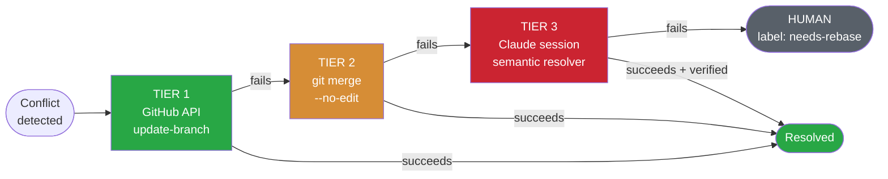
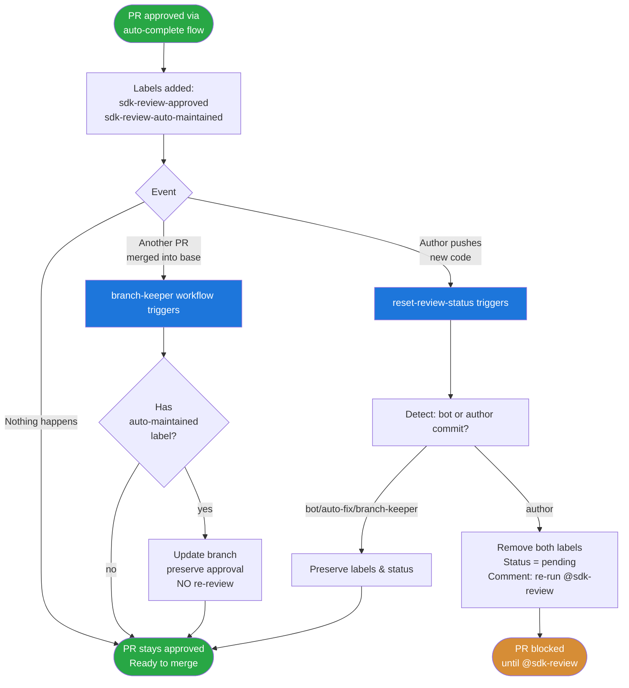
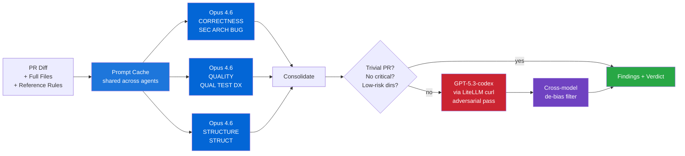
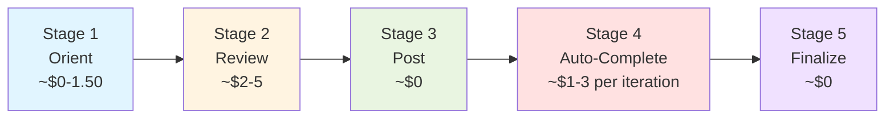
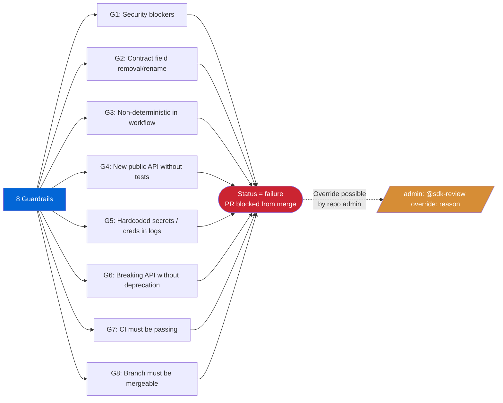

# SDK Review v2 — Complete Flow

> Multi-model PR review with auto-complete (fix) loop, conflict resolution, and human escalation.
> Triggered by `@sdk-review` comments on PRs.

---

## High-Level: Four Routes

```mermaid
flowchart LR
    A([Developer comments<br/>on PR]) --> B{Which command?}

    B -->|@sdk-review| C[Route 1<br/>REVIEW ONLY]
    B -->|@sdk-review<br/>auto-complete| D[Route 2<br/>AUTO-COMPLETE LOOP]
    B -->|@sdk-review<br/>stop| S[Route 3<br/>CANCEL]
    B -->|@sdk-review<br/>override: reason| E[Route 4<br/>ADMIN OVERRIDE]

    C --> F([Findings posted<br/>Author fixes manually])
    D --> G([Bot fixes + re-reviews<br/>until clean, then approves])
    S --> T([In-progress runs cancelled<br/>sdk-review-stopped label set])
    E --> H([Status forced to pass<br/>audit logged])

    style C fill:#e1f5ff,stroke:#0366d6
    style D fill:#fff4e1,stroke:#d68d36
    style S fill:#f0e1ff,stroke:#6f42c1
    style E fill:#ffe1e1,stroke:#cb2431
```

Aliases: `resolve all issues` == `auto-complete`, `cancel` == `stop`.

---

## Full Pipeline

```mermaid
flowchart TD
    START([@sdk-review comment]) --> ORIENT

    subgraph ORIENT["STAGE 1: ORIENT"]
        O1[Parse command<br/>auto_fix? override?] --> O2[Check PR state]
        O2 --> O3[Detect previous review]
        O3 --> O4[Set status = pending]
        O4 --> O5[Check CI status]
        O5 --> O6{Branch behind<br/>or conflicts?}
        O6 -->|behind| O7[Tier 1: API update]
        O6 -->|clean| REVIEW
        O7 --> O8{Conflict?}
        O8 -->|no| REVIEW
        O8 -->|yes| O9[Tier 2: git merge]
        O9 --> O10{Resolved?}
        O10 -->|yes| REVIEW
        O10 -->|no| O11[Tier 3: Claude session<br/>semantic resolver]
        O11 --> O12{Resolved?}
        O12 -->|yes| REVIEW
        O12 -->|no| HUMAN_REBASE([STOP<br/>label: needs-rebase])
    end

    subgraph REVIEW["STAGE 2: REVIEW"]
        R1[Read full files<br/>+ reference docs<br/>+ holistic file assessment]
        R1 --> R2[Wave 1: 3 Opus agents PARALLEL]
        R2 --> R2A[Agent A: CORRECTNESS<br/>SEC + ARCH + BUG]
        R2 --> R2B[Agent B: QUALITY<br/>QUAL + TEST + DX]
        R2 --> R2C[Agent C: STRUCTURE<br/>STRUCT + symptoms vs causes]
        R2A --> R3
        R2B --> R3
        R2C --> R3
        R3{Skip Wave 2?<br/>trivial PR + no critical?}
        R3 -->|yes, skip| R5
        R3 -->|no, run| R4[Wave 2: GPT-5.3-codex<br/>adversarial via curl]
        R4 --> R5[De-bias + consolidate<br/>cross-model agreement]
        R5 --> R6[Delta tracking<br/>RESOLVED / STILL / NEW / REGRESSION]
    end

    REVIEW --> POST

    subgraph POST["STAGE 3: POST"]
        P1[Summary comment<br/>findings grouped by file]
        P1 --> P2[Inline comments max 15<br/>with exact fix code]
        P2 --> P3[Reply to author Q&A<br/>on previous comments]
        P3 --> P4[Resolve fixed inline threads<br/>via GraphQL]
        P4 --> P5[Set commit status<br/>success or failure]
        P5 --> P6[Manage labels]
    end

    POST --> VERDICT{VERDICT}

    VERDICT -->|READY TO MERGE| FINALIZE
    VERDICT -->|NEEDS FIXES<br/>+ auto_fix=true| FIX
    VERDICT -->|NEEDS FIXES<br/>+ auto_fix=false| END_REVIEW([STOP<br/>Author fixes manually])
    VERDICT -->|BLOCKED| END_BLOCKED([STOP<br/>Critical security issue])
    VERDICT -->|NEEDS HUMAN REVIEW| END_HUMAN([STOP<br/>label: needs-human-review<br/>Design decision needed])

    subgraph FIX["STAGE 4: AUTO-COMPLETE (new Claude session)"]
        F1[Read SDK_REVIEW comment]
        F1 --> F2[For each PATCH/MIGRATE finding<br/>any severity, all fixed]
        F2 --> F3[Brainstorm → Plan → Apply]
        F3 --> F4[Run pre-commit + tests + pyright]
        F4 --> F5{All verifications pass?}
        F5 -->|fail| F6[Revert THIS fix only]
        F6 --> F7
        F5 -->|pass| F7[Commit fix]
        F7 --> F8[Push to PR branch]
        F8 --> FSTOP{sdk-review-stopped<br/>label set?}
        FSTOP -->|yes| END_STOP([STOP<br/>Auto-complete cancelled<br/>by author])
        FSTOP -->|no| F9{Iteration < 3?}
        F9 -->|yes| F10[Self-trigger:<br/>@sdk-review auto-complete --iteration=N+1]
        F9 -->|no| END_MAX([STOP<br/>Max 3 iterations<br/>label: needs-human-review])
        F10 --> START
    end

    subgraph FINALIZE["STAGE 5: FINALIZE"]
        FN1[Update branch<br/>merge base in]
        FN1 --> FN2[Resolve any new conflicts<br/>Tier 1 → 2 → 3]
        FN2 --> FN3[Wait for CI<br/>max 10 min]
        FN3 --> FN4{CI passes?}
        FN4 -->|no| FN_FAIL([STOP<br/>CI failing after update])
        FN4 -->|yes| FN5[Approve PR]
        FN5 --> FN6[Add label:<br/>sdk-review-approved]
        FN6 --> FN7{Was resolve-all flow?}
        FN7 -->|yes| FN8[Add label:<br/>sdk-review-auto-maintained]
        FN7 -->|no| FN9
        FN8 --> FN9[Set status = success<br/>Post: Ready to merge]
    end

    FINALIZE --> END_OK([READY TO MERGE])

    style START fill:#0366d6,color:#fff
    style ORIENT fill:#e1f5ff,stroke:#0366d6
    style REVIEW fill:#fff4e1,stroke:#d68d36
    style POST fill:#e9f5e1,stroke:#28a745
    style FIX fill:#ffe1e1,stroke:#cb2431
    style FINALIZE fill:#f0e1ff,stroke:#6f42c1
    style END_OK fill:#28a745,color:#fff
    style END_BLOCKED fill:#cb2431,color:#fff
    style END_HUMAN fill:#d68d36,color:#fff
    style END_MAX fill:#d68d36,color:#fff
    style END_REVIEW fill:#586069,color:#fff
    style END_STOP fill:#586069,color:#fff
    style HUMAN_REBASE fill:#d68d36,color:#fff
    style FN_FAIL fill:#cb2431,color:#fff
```

---

## Conflict Resolution: Three Tiers



---

## Branch Lifecycle (Post-Approval Maintenance)



---

## Multi-Model Architecture (Cost-Optimized)



---

## Labels (Complete Inventory)

```mermaid
flowchart LR
    L1[sdk-review-approved] -.->|set when| S1([PR passes review])
    L1 -.->|removed when| R1([Author pushes code])

    L2[sdk-review-auto-maintained] -.->|set when| S2([auto-complete flow approves])
    L2 -.->|removed when| R2([Author pushes code])

    L3[needs-human-review] -.->|set when| S3([DESIGN_CHANGE finding<br/>OR max iterations hit])
    L3 -.->|removed when| R3([Issue resolved])

    L4[needs-rebase] -.->|set when| S4([All 3 conflict tiers fail])
    L4 -.->|removed when| R4([Author rebases manually])

    L5[sdk-review-stopped] -.->|set when| S5([@sdk-review stop<br/>command received])
    L5 -.->|removed when| R5([Next @sdk-review<br/>picks it up])

    style L1 fill:#0e8a16,color:#fff
    style L2 fill:#1d76db,color:#fff
    style L3 fill:#d93f0b,color:#fff
    style L4 fill:#e4e669,color:#000
    style L5 fill:#586069,color:#fff
```

---

## What Each Stage Costs



| Scenario | Total Cost | Total Time |
|----------|-----------|-----------|
| Trivial PR, review only | ~$0.50 | ~5 min |
| Typical PR, review only | ~$3-5 | ~8 min |
| Typical PR, auto-fix (1 iter) | ~$5-7 | ~12 min |
| Typical PR, auto-fix (3 iter max) | ~$10-15 | ~30 min |
| Large PR, auto-fix (3 iter) | ~$25-45 | ~45 min |

---

## Guardrails (Always Block Merge)



---

## At a Glance

| Aspect | Detail |
|--------|--------|
| **Trigger** | `@sdk-review` comment on a PR (no auto-trigger on push) |
| **Required check** | `sdk-review` status check blocks merge |
| **Models** | Claude Opus 4.6 (review + fix) + GPT-5.3-codex (adversarial), via `llmproxy.atlan.dev` |
| **Agents** | 3 Opus domain agents (CORRECTNESS, QUALITY, STRUCTURE) + 1 GPT adversarial |
| **Max auto-fix iterations** | 3 |
| **Conflict resolution** | 3-tier cascade: API → git → Claude semantic |
| **Override** | Repo admins via `@sdk-review override: <reason>` |
| **Q&A on inline comments** | Author replies trigger an answer agent to clarify or re-evaluate |
| **Branch maintenance** | Auto-update for PRs with `sdk-review-auto-maintained` label |
| **Cost optimization** | Prompt caching, smart Codex skip, file truncation for large files |
