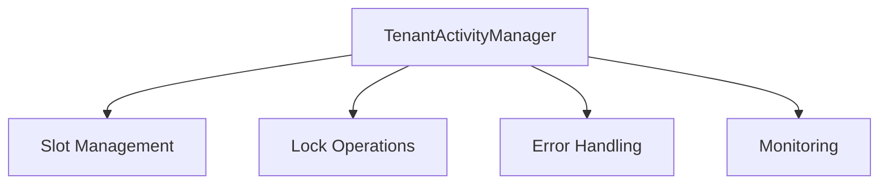
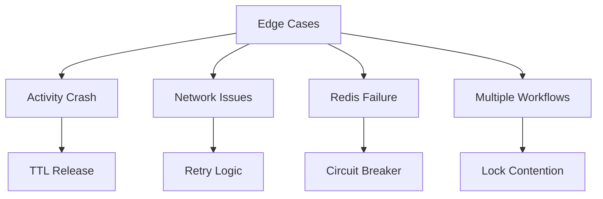

# TenantActivityManager TRD

## 1. Purpose
Manages tenant-level activity concurrency using Dapr distributed locks to limit concurrent publish activities.

## 2. Core Components

## 3. Key Operations

### 3.1 Slot Management
- **acquire_slots(count)**
  - Input: Number of slots needed
  - Output: List<SlotInfo>
  - Behavior: Atomic, returns available slots up to requested count

- **release_slot(slot_number)**
  - Input: Slot number
  - Behavior: Immediate release, cleanup

### 3.2 Lock Operations
- Resource ID format: `tenant:{id}:slot:{number}`
- TTL: 30 seconds
- Owner format: `workflow:{id}:activity:{id}`

## 4. Error Handling
- Activity failures → Auto release via TTL
- Network issues → Retry with backoff
- Inconsistent state → Self-heal via TTL
- System crashes → Auto cleanup via leases

## 5. Monitoring
- Active slots count
- Lock acquisition success rate
- Activity completion rate
- Error rates

## 6. Edge Cases

## 7. Performance Requirements
- Lock operations: < 100ms
- Memory: < 10MB
- Minimal CPU usage
- Efficient Redis operations

Would you like me to expand on any specific section?