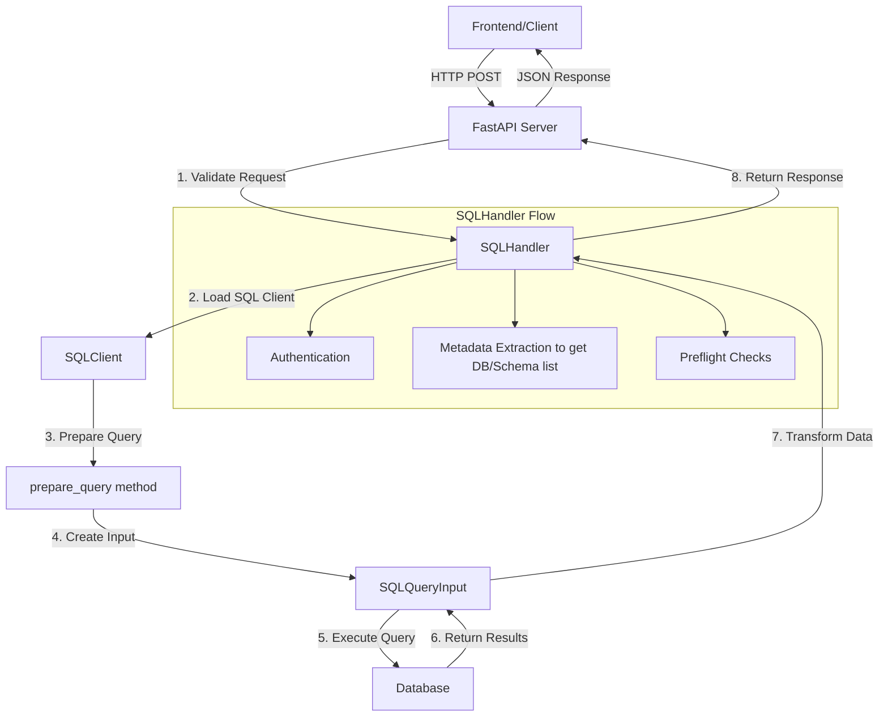

# Step-by-Step Guide to Create an SQL Application

This guide will walk you through the process of creating an SQL application using the Atlan Platform SDK. We will cover each component and explain how you can extend them for your specific needs.

When we say "SQL application," we mean an application that interacts with an SQL database, extracts metadata from the database, (optionally) processes the metadata to provide capabilities (like lineage, popularity metrics, etc.) and stores the metadata in a specified format in the configured object store. The use case can be extended by adding more steps to the workflow, such as data validation, transformation, and more.


```{tip}
In simple terms, a workflow is a series of steps or tasks that are executed in a specific order to achieve a goal. In the context of an SQL application, these steps could include connecting to the database, extracting metadata, running validation checks, and processing data.

Activities are the individual tasks that make up the workflow. Each activity performs a specific job, such as querying a database for schema details or validating table data. These activities are linked together to form the complete workflow.
```

At a high level, creating an SQL application involves the following steps:

1. Configuring all components needed to interact with the database.
2. Setting up the Workflow Worker, which executes the workflow logic and handles authentication, metadata extraction, preflight checks, and any other custom logic.
3. Building the Workflow and activities, which define how and when various tasks are executed and customize the behavior for your specific use case.

## Prerequisites

Before you begin, make sure you have:

- Installed the Atlan Platform SDK
- Set up your development environment with Python 3.11 or above. You can check your Python version by running the following command in your terminal:
    - `python --version`
    - Ensure that the output shows Python 3.11 or above.
- Familiarity with the basics of SQL and database concepts

## Overview of SQL Workflows

An SQL workflow defines a series of steps that interact with a database. Let's explore the main steps:

- **Authentication**: Verifying database credentials to ensure proper access.
- **Metadata extraction**: Retrieving schema, table, and column information to understand the database structure.
- **Preflight checks**: Verifying database accessibility and structure before running the workflow.
- **Execution logic**: Defining the tasks that the workflow will carry out once started, such as processing data or running custom queries.

## Understanding the Application SDK Structure

The Atlan Platform SDK offers a set of base interfaces and abstract classes that provide default behavior for common tasks such as authentication, metadata extraction, and preflight checks. You can either use these default implementations or extend them to create custom workflows tailored to your specific use case.

Here’s an overview of the core components:

- `SQLWorkflowAuthInterface`: This interface handles authentication for the workflow. The default implementation establishes a connection to the database using the provided credentials and checks their validity.

- `SQLWorkflowMetadataInterface`: This interface manages metadata extraction from the database.

- `SQLWorkflowPreflightCheckInterface`: This interface runs preflight checks before the workflow is executed.

- `SQLWorkflowWorkerInterface`: This interface handles the execution logic of the workflow. The default implementation is responsible for running the tasks defined by the workflow, such as extracting data, running preflight checks, and processing results. You can override this interface to implement custom workflow logic, such as data transformations or running multiple queries in sequence.

These components are flexible, enabling you to build workflows with custom logic or simply use the out-of-the-box implementations. Now, let’s start with setting up the necessary configurations for interacting with the database.


## Detailed Architecture and Flow



## Understanding the Components

### 1. Constants and Query Definition (const.py)

The `const.py` file serves as a central repository for SQL queries used throughout the application. These queries are referenced by the SQLHandler for various operations:

```python
# app/const.py
class SQLQueries:
    # Authentication query
    TEST_AUTH_SQL = "SELECT 1;"
    
    # Metadata queries
    METADATA_SQL = """
    SELECT schema_name, catalog_name
    FROM INFORMATION_SCHEMA.SCHEMATA;
    """
    
    # Tables check query
    TABLES_CHECK_SQL = """
    SELECT COUNT(*)
    FROM INFORMATION_SCHEMA.TABLES
    WHERE concat(TABLE_CATALOG, concat('.', TABLE_SCHEMA)) !~ '{normalized_exclude_regex}'
        AND concat(TABLE_CATALOG, concat('.', TABLE_SCHEMA)) ~ '{normalized_include_regex}'
        {temp_table_regex_sql};
    """
```


### 2. Request Flow and Data Processing

#### Frontend to FastAPI Server

The frontend sends a POST request to the FastAPI server with the necessary parameters. The request is validated and processed by the SQLHandler.

When a client makes a request, it sends a payload in the following format:

```json
{
    "credentials": {
        "authType": "basic",
        "host": "localhost",
        "port": "5432",
        "username": "postgres",
        "password": "password",
        "database": "postgres"
    },
    "metadata": {
        "exclude-filter": "{}",
        "include-filter": "{}",
        "temp-table-regex": "",
        "extraction-method": "direct"
    }
}
``` 


#### SQLHandler Processing


The SQLHandler processes requests through several stages:

1. **Authentication**:

```81:102:application_sdk/handlers/sql.py
    @transform(
        sql_input=SQLQueryInput(query="test_authentication_sql", chunk_size=None)
    )
    async def test_auth(
        self,
        sql_input: pd.DataFrame,
        **kwargs: Dict[str, Any],
    ) -> bool:
        """
        Test the authentication credentials.

        :raises Exception: If the credentials are invalid.
        """
        try:
            sql_input.to_dict(orient="records")
            return True
        except Exception as exc:
            logger.error(
                f"Failed to authenticate with the given credentials: {str(exc)}"
            )
            raise exc
```

2. **Query Preparation**:

The `prepare_query` method processes the SQL query by replacing placeholders with actual values:

```python
def prepare_query(query: str, payload: Dict[str, Any], **kwargs: Any) -> str:
    # Get metadata filters
    metadata = payload.get("metadata", {})
    
    # Process regex patterns
    exclude_filter = json.loads(metadata.get("exclude-filter", "{}"))
    include_filter = json.loads(metadata.get("include-filter", "{}"))
    
    # Replace placeholders
    formatted_query = query.format(
        normalized_exclude_regex=create_regex_pattern(exclude_filter),
        normalized_include_regex=create_regex_pattern(include_filter),
        temp_table_regex_sql=kwargs.get("temp_table_regex_sql", "")
    )
    
    return formatted_query
```


3. **SQLQueryInput Processing**:

```python
    Attributes:
        query (str): The SQL query to execute.
        engine (Union[Engine, str]): SQLAlchemy engine or connection string.
        chunk_size (Optional[int]): Number of rows to fetch per batch.
        state (Optional[ActivitiesState]): State object for the activity.
        async_session: Async session maker for database operations.
    """

    query: str
    engine: Optional[Union[Engine, str]]
    chunk_size: Optional[int]
    state: Optional[ActivitiesState] = None
    async_session: Optional[AsyncSession] = None
    temp_table_sql_query: Optional[str] = None

    def __init__(
        self,
        query: str,
        engine: Optional[Union[Engine, str]] = None,
        chunk_size: Optional[int] = 100000,
        temp_table_sql_query: Optional[str] = None,
        **kwargs: Dict[str, Any],
    ):
        """Initialize the async SQL query input handler.

        Args:
            engine (Union[Engine, str]): SQLAlchemy engine or connection string.
            query (str): The SQL query to execute.
            chunk_size (Optional[int], optional): Number of rows per batch.
                Defaults to 100000.
        """
        self.query = query
        self.engine = engine
        self.chunk_size = chunk_size
        self.temp_table_sql_query = temp_table_sql_query
        if self.engine and isinstance(self.engine, AsyncEngine):
            self.async_session = sessionmaker(
                self.engine, expire_on_commit=False, class_=AsyncSession
            )

```

### 3. Data Fetching and Transformation

The SQLHandler uses the SQLQueryInput class to execute queries and process results:


1. Query Execution:
```python
async def fetch_metadata(self, **kwargs: Dict[str, Any]) -> List[Dict[str, str]]:
    query = self.prepare_query(self.metadata_sql, kwargs)
    sql_input = SQLQueryInput(query=query, engine=self.engine)
    return await sql_input.get_dataframe()
```

2. Data Transformation:

```python
    async def preflight_check(self, payload: Dict[str, Any]) -> Dict[str, Any]:
        """
        Method to perform preflight checks
        """
        logger.info("Starting preflight check")
        results: Dict[str, Any] = {}
        try:
            (
                results["databaseSchemaCheck"],
                results["tablesCheck"],
            ) = await asyncio.gather(
                self.check_schemas_and_databases(payload),
                self.tables_check(payload),
            )

            if (
                not results["databaseSchemaCheck"]["success"]
                or not results["tablesCheck"]["success"]
            ):
                raise ValueError(
                    f"Preflight check failed, databaseSchemaCheck: {results['databaseSchemaCheck']}, tablesCheck: {results['tablesCheck']}"
                )

            logger.info("Preflight check completed successfully")
        except Exception as exc:
            logger.error("Error during preflight check", exc_info=True)
            results["error"] = f"Preflight check failed: {str(exc)}"
        return results
```


## Configuration

To interact with the database, we need to configure
- Authentication
- Metadata extraction
- Preflight checks

### Defining the `SQLWorkflowAuthInterface` class

The `SQLWorkflowAuthInterface` class is used to authenticate the SQL workflow. The default implementation of `SQLWorkflowAuthInterface` runs a simple SQL query(defined by `TEST_AUTHENTICATION_SQL`) on the source database.

```{tip}
You can choose to not override this class and use the default implementation of this class, or you can choose to override this class to use your custom implementation of testing authentication.

If you wish to use the default implementation of this class, feel free to skip this section and move to the next section.
```

When overriding this class, you can either provide your own implementation of `TEST_AUTHENTICATION_SQL` SQL query and use the default implementation of testing authentication, where it creates a connection to the source database, and checks if the query completes successfully.

For example -

```
class MySQLWorkflowAuthInterface(SQLWorkflowAuthInterface):
    TEST_AUTHENTICATION_SQL: str = "SELECT 1;"
```

Or you can also choose to override the `test_auth` method and provide your own implementation -

```
class MySQLWorkflowAuthInterface(SQLWorkflowAuthInterface):
    TEST_AUTHENTICATION_SQL: str = "SELECT 1;"


    def test_auth(self, credential: Dict[str, Any]) -> bool:
        # Your authentication logic here
        return True

```

### Defining the `SQLWorkflowMetadataInterface` class

The `SQLWorkflowMetadataInterface` class is responsible for fetching metadata from the database. This includes extracting schema, table, and column information, which can be useful for understanding the structure of the database.

If you want to customize the metadata extraction SQL, you can override the default `METADATA_SQL`. `METADATA_SQL` defines the SQL query to fetch the metadata.

```python
from application_sdk.workflows.sql.metadata import SQLWorkflowMetadataInterface
class MySQLWorkflowMetadata(SQLWorkflowMetadataInterface):
    METADATA_SQL = """
    SELECT schema_name, catalog_name
    FROM INFORMATION_SCHEMA.SCHEMATA;
    """
```

You can also optionally override the default implementation of `fetch_metadata` function,

```python
from application_sdk.workflows.sql.metadata import SQLWorkflowMetadataInterface
class MySQLWorkflowMetadata(SQLWorkflowMetadataInterface):
    METADATA_SQL = """
    SELECT schema_name, catalog_name
    FROM INFORMATION_SCHEMA.SCHEMATA;
    """
    DATABASE_KEY: str = "TABLE_CATALOG"
    SCHEMA_KEY: str = "TABLE_SCHEMA"

    def fetch_metadata(self, credential: Dict[str, Any]) -> List[Dict[str, str]]:
        # Your custom logic here
        return []
```

### Defining the `SQLWorkflowPreflightCheckInterface` class

The `preflight_checks` method in `SQLWorkflowPreflightCheckInterface` class is used to perform preflight checks on the data.

You can override this class and set the values of `METADATA_SQL`, `TABLES_CHECK_SQL` to define the SQL query to fetch metadata, and the SQL query to fetch the tables.

For example,

```python
from application_sdk.workflows.sql.preflight import SQLWorkflowPreflightCheckInterface
class MySQLWorkflowPreflight(SQLWorkflowPreflightCheckInterface):
    PREFLIGHT_SQL = """
    SELECT COUNT(*)
    FROM your_table;
    """
    TABLES_CHECK_SQL = """
    SELECT COUNT(*)
    FROM INFORMATION_SCHEMA.TABLES;
    """

    def preflight_check(self, payload: Dict[str, Any]) -> Dict[str, Any]:
        # Your preflight check logic here
        return {"status": "success", "message": "Preflight check completed successfully"}
```

## Setting up the Workflow Worker

### Defining the `SQLWorkflowWorkerInterface` class

The `SQLWorkflowWorkerInterface` class handles the execution of the workflow. It provides the core logic to interact with the database, fetch data (such as schemas, tables, columns), and process that data according to the workflow’s configuration. The `execute_workflow` method is used to execute the workflow.

The default implementation of SQLWorkflowWorkerInterface supports:

- Database connection management: Using SQLAlchemy, the worker connects to the database using the credentials provided at runtime.
- Query execution: It runs SQL queries in batches using either client-side or server-side cursors, depending on your database configuration.
- Data fetching: It retrieves database metadata, including databases, schemas, tables, and columns.
- Data transformation: The fetched data can be transformed through a provided `TransformerInterface` before being stored.
- Activity management: It defines default activities such as fetching databases, schemas, tables, and columns, which can be run in parallel as part of the workflow.

You should override `SQLWorkflowWorkerInterface` if you need to customize how the workflow interacts with your database or how the fetched data is processed. For example, you may want to:

- Customize SQL Queries: Override the default SQL queries (e.g., `DATABASE_SQL`, `SCHEMA_SQL`, `TABLE_SQL`, and `COLUMN_SQL`) to tailor the queries to your database structure.
- Transform Data: Customize the transformation logic by providing a custom implementation of `TransformerInterface`.
- Custom Workflow Logic: If you need to perform additional tasks beyond the default activities (e.g., post-processing the data or handling specific edge cases), you can override the run method to define a custom sequence of activities.

Create a class that inherits from `SQLWorkflowWorkerInterface` to define the workflow worker:
```python
from application_sdk.workflows.sql.worker import SQLWorkflowWorkerInterface
class MySQLWorkflowWorker(SQLWorkflowWorkerInterface):
    DATABASE_SQL = "Your custom database extraction SQL"
    SCHEMA_SQL = "Your custom schema extraction SQL"
    TABLE_SQL = "Your custom table extraction SQL"
    COLUMN_SQL = "Your custom colum extraction SQL"

    def __init__(self, metadata: SQLWorkflowMetadataInterface, preflight: SQLWorkflowPreflightInterface):
        super().__init__(metadata, preflight)
```

## Building the Workflow

### Defining the `SQLWorkflowBuilder` class

The `SQLWorkflowBuilder` class is responsible for constructing the entire workflow by integrating the core components like authentication, metadata extraction, preflight checks, and the worker logic that we've built above.

It defines abstract methods to get the SQLAlchemy connection string and connection arguments, which are used to create a database engine for workflow execution. By default, the class provides an engine using SQLAlchemy and allows for the use of pre-built or custom interfaces for authentication, metadata, preflight checks, and worker logic.

Let's create a class that inherits from `SQLWorkflowBuilder` to define our custom builder:

```python
class MyWorkflowBuilder(SQLWorkflowBuilder):
    def get_sqlalchemy_connection_string(self, credentials: Dict[str, Any]) -> str:
        encoded_password = quote_plus(credentials["password"])
        username = credentials['username']
        host = credentials['host']
        port = credentials['port']
        database = credentials['database']

        return "My custom credentials string"

    def __init__(self, *args: Any, **kwargs: Any):
        self.auth_interface = MySQLWorkflowAuthInterface()
        self.metadata_interface = MySQLWorkflowMetadata(self.get_sql_engine)
        self.preflight_interface = MySQLWorkflowPreflight(self.get_sql_engine)
        self.worker_interface = MySQLWorkflowWorker(
            "My Application Name", get_sql_engine=self.get_sql_engine
        )
        super().__init__(
            auth_interface=self.auth_interface,
            metadata_interface=self.metadata_interface,
            preflight_check_interface=self.preflight_interface,
            worker_interface=self.worker_interface,
            *args,
            **kwargs,
        )
```

Once you've created your WorkflowBuilder class, you can start using it in your project,

```python
my_workflow_builder = MyWorkflowBuilder()
```